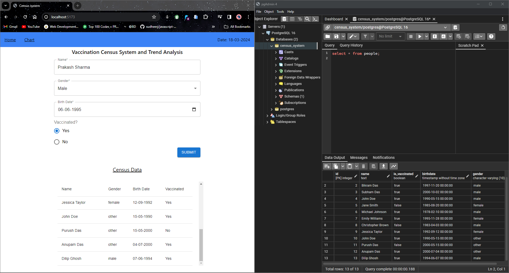
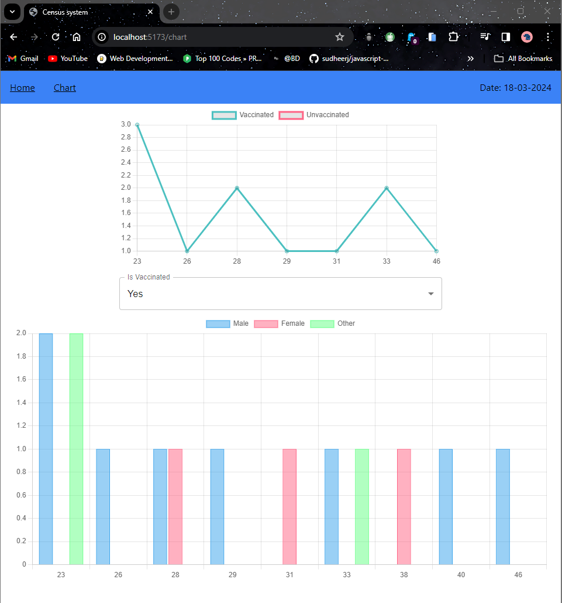

# Census system and trend analysis

## Overview
The Vaccination Census System is a web application designed to collect and analyze vaccination data. It allows users to input census data including name, gender, birth date, and vaccination status. The system then provides visualizations of vaccination trends and gender distribution.
This repo contain both client and server code. Because in this project i used `PostgreSQL`  

## Setup and Run

1. Clone the repository to your local machine:
   ```bash
   git clone https://github.com/bikashd003/census-system.git

### Setup and run frontend
2. Navigate to the project directory:
    ```bash
    cd Client
3. Install dependencies:
   ```bash
   npm install
4. Start the development server:
   ```bash
   npm run dev
### Setup and run Backend

2. Navigate to the project directory:
    ```bash
    cd Server
3. Install dependencies:
   ```bash
   npm install
4. Setup `.env` file
   ```bash
    USER="postgres"
    HOST="localhost"
    DATABASE=<database_name>
    PASSWORD=<your_password>
    PORT=5432

5. Start the development server:
   ```bash
   node Index.js

## Features

### Census Form
- Allows users to input census data, including name, gender, birth date, and vaccination status.
- Validates user inputs to ensure all required fields are filled.

### Census Table
- Displays a table of census data, including name, gender, birth date, and vaccination status.
- Provides a clear view of all census records stored in the system.

### Census Chart
- Visualizes vaccination trends using line charts.
- Allows users to toggle between vaccinated and unvaccinated data for analysis.

### Gender Distribution
- Provides bar graph representation of gender distribution across different age groups.
- Each age group displays three bars representing male, female, and other genders.
## Demo screenshots
### live interface and postgresSQL GUI (13 row available in table)

### after added latest row i.e Prakash Sharma (14 row present)

### trend analysis

### live demo video link
https://www.loom.com/share/33bf97d639da481497514b3703c7b756?sid=152c6629-cc17-4e1e-bc9a-cf4093864b3c

## References and Resources

### React
- [React Documentation](https://react.dev/reference/react)

### React Router
- [React Router Documentation](https://reactrouter.com/en/main/start/tutorial)

### Material-UI
- [Material-UI Documentation](https://mui.com/material-ui/getting-started/)

### Chart.js
- [Chart.js Documentation](https://github.com/chartjs/awesome#integrations)

### PostgreSQL
- [PostgreSQL Documentation](https://www.postgresql.org/docs/current/index.html)
